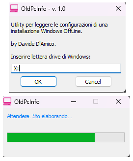

# oldpcinfo
A Simple Old PC Info Reporter

## Descrizione
Software per reperire informazioni su una vecchia installazione di Windows su disco OffLine.

## Come usare il software
1. Scarica l'ultima verisone e compilalo. Trovi le istruzioni su [https://www.autoitscript.com/autoit3/docs/intro/compiler.htm](https://www.autoitscript.com/autoit3/docs/intro/compiler.htm)
2. Esegui oldpcinfo.exe

## Screenshot

## Download
[Clicca qui](https://github.com/davide-damico/oldpcinfo/releases/latest) per scaricare l'ultima versione!

## Author
Davide D'Amico - Pescara (https://www.novasoftonline.net)

## Grazie per aver provato il mio software
Riscontri qualche problema? Apri un [Caso](https://github.com/davide-damico/oldpcinfo/issues).  
